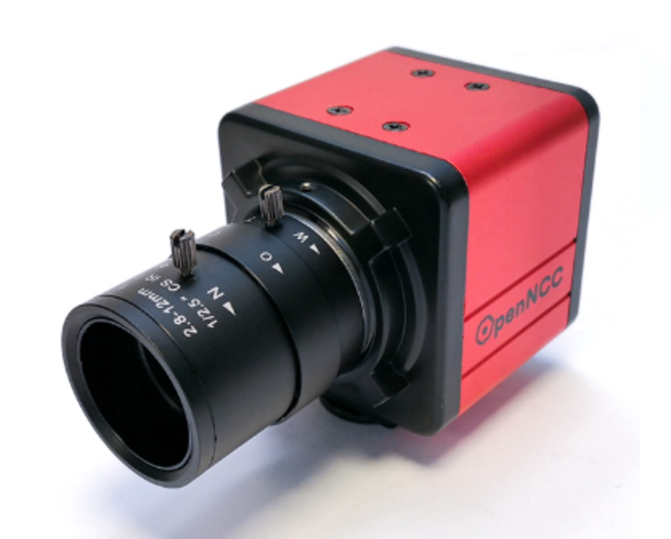
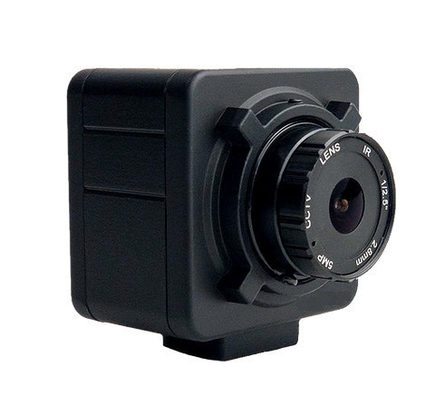
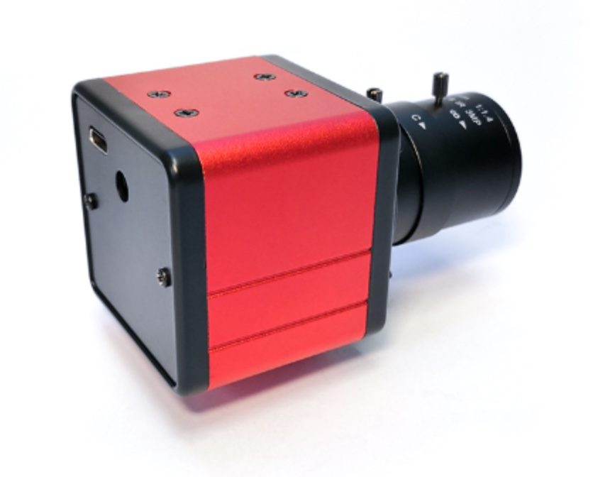
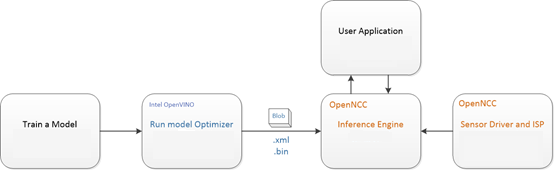

# VCAM

VCAM is one of the Hydra AI camera prototype powered by Intel Movidius Myriad VPU, which is a low-power SoC that can be used for drones, intelligent cameras, VR/AR headsets, or other deep learning and AI vision application acceleration devices.

- Plug & Play: 
  Users can quickly create your own versatile AI camera within 30 seconds by plugging a USB-C data interface into a computer and start developing.

- Standard Model: 
  VCAM has the advantage of the integrated VPU chip,  which is compatible with the Paddle & OpenVINO models.

- Multi-frameworks: 
  VCAM supports Paddle, Caffe, ONNX, TensorFlow, MXNet and other deep learning frameworks for user-friendly development and use.

- High-quality Output: 
  It has been factory video debugging to support 1920x1080 or 4K  resolution picture quality, support YUV420, H.264, H265,MJPEG and other video formats output.

- Secondary Development: 
  VCAM provides a dedicated SDK development kit and related technical documentation, which supports C/C++/Python language. Users can easily call the relevant API interface to initiate camera parameter setting, model downloading, output video parameter setting, and quickly launch algorithm deployment of intelligent cameras. VCAM supports official models provided by Paddle OpenVINO and custom algorithm models.

  

## SDK

Products:
- VCAM DK
- VCAM Lite
- VCAM USB

Platforms:
- Ubuntu 16.04, Ubuntu 18.04
- Windows 10
- Raspberry Pi
- Arm Linux (Tool chain cross compilation is required)

Languages:
- C/C++
- Python3.5, Python3.7

## Operating Mechanism
From a model training environment to embedded deployment, it is a very important task, which requires mastering the framework of deep learning, such as commonly used: Caffe*, TensorFlow*, MXNet*, Kaldi*, etc.In addition, it is very important to master the deployed embedded platform. You need to understand the platform performance, system architecture characteristics, and then combine the platform characteristics to optimize the training model framework, and finally tune, transplant, and deploy to the embedded platform.

VCAM focuses on the rapid deployment of deep learning models, is compatible with Intel OpenVINO tools, and for embedded graphics and image application scenarios, it has completed the integration of different resolution sensors from 2MP to 20MP on end-point target devices, and the end-point target devices has realized the deployment of professional-level ISP. OpenVINO optimized converted model files can be dynamically downloaded to the end-point VCAM camera to achieve rapid deployment of deep learning models. VCAM has designed independent working mode, mixed development mode and co-processing compute stick mode to adapt to different work application scenarios.

## Tutorials
- [Code Structure](./doc/structure.md)
- [Installation](./doc/installation.md)
- [Learn to Use](./example/how_to) 
- [Model Base](./sdk/source/model/2020.3)  
- [Download & Convert Models](./sdk/tools)  
- [Linkage Demos](./example/linkage_demo)
- [Viewer](./apps/vcam_viewer)

## Integrated Models
| Model Category       | Name                | Brief Introduction                                                     |
| :---: | :---: | :---: |
| Object Classification | classification-fp16 | ssd_mobilenet_v1_coco model can detect almost 90 objects |
| Face & Human Detection | face-detection-adas-0001-fp16 | A face detector for driver monitoring and similar scenarios. The network  features a default MobileNet backbone that includes depth-wise  convolutions to reduce the amount of computation for the 3x3 convolution block |
|| face-detection-retail-0004-fp16 | A face detector based on SqueezeNet light (half-channels) as a backbone with a single SSD for indoor/outdoor scenes shot by a front-facing camera |
|| face-person-detection-retail-0002-fp16 | Pedestrian detector based on the backbone with hyper-feature + R-FCN for the Retail scenario |
|| person-detection-retail-0013-fp16 | Pedestrian detector for the Retail scenario. It is based on  MobileNetV2-like backbone that includes depth-wise convolutions to  reduce the amount of computation for the 3x3 convolution block |
|| pedestrian-detection-adas-0002-fp16 | Pedestrian detection network based on SSD framework with tuned MobileNet v1 as a feature extractor. |
| People, Vehicles & Bicycles Detection | person-vehicle-bike-detection-crossroad-0078-fp16 | Person/Vehicle/Bike detector is based on SSD detection architecture, RMNet backbone, and  learnable image downscale block (like  person-vehicle-bike-detection-crossroad-0066, but with extra pooling) |
|| pedestrian-and-vehicle-detector-adas-0001-fp16 | Pedestrian and vehicle detection network based on MobileNet v1.0 + SSD. |
| Vehicle Detection | vehicle-detection-adas-0002-fp16 | A vehicle detection network based on an SSD framework with tuned MobileNet v1 as a feature extractor. |
| Mask Detection | mask-detect-fp16 | Mask detector. | Under license |
| License Plate Recognition | vehicle-license-plate-detection-barrier-0106-fp16 | A MobileNetV2 + SSD-based vehicle and (Chinese) license plate detector for the "Barrier" use case. |
| Face Attributes | interactive_face_detection_demo | This demo executes four parallel infer requests for the Age/Gender  Recognition, Head Pose Estimation, Emotions Recognition, and Facial  Landmarks Detection networks that run simultaneously |
| Body Extraction | human-pose-estimation-0001-fp16 | A multi-person 2D pose estimation network (based on the OpenPose approach) with tuned MobileNet v1 as a feature extractor. |

## Contact
Please contact hydra@baidu.com for technical discussion and service@eyecloud.tech for more OEM/ODM hardware information 

