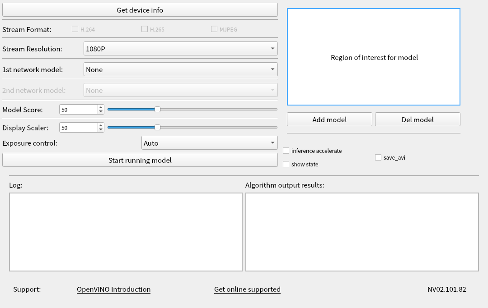

# VCAM Viewer

VCAM View is a software used to quickly experience the VCAM  development kit . The default model under VCAM View does not depend  on OpenVINO. VCAM View integrates all APIs of NCC SDK, realizes  connection to VCAM, downloads of firmware and AI models, video stream display, and post-processing of algorithm results. Users can operate  and control the camera through a friendly interface.

### Viewer structure

| Directory                | Content            |
| ------------------------ | :----------------- |
| qt_package               | QT source code     |
| [linux](./linux)         | Linux compiled     |
| [raspberry](./raspberry) | Raspberry compiled |
| [windows](./windows)     | WIndows compiled   |

## Functions detail

1）**Get Device Info**：Obtain the USB connection information of the device and the computer,  and the NCC device module information. If the connected device supports  it, you can unlock more functional options. (For example, if NCC is  connected to a computer via USB 3.0, you can unlock the yuv output  format; if NCC is equipped with a 4K module, you can unlock the 4K  resolution display)

2）**Stream Format**：Choose NCC camera USB video output format, currently supports YUV420P,  H.264, MJPEG format. (You need to click Get Device Info before selecting YUV420P, which is only available when USB 3.0 is connected)

3）**Stream Resolution**：Change the video resolution of NCC camera, 1080P or 4K can be selected.  4K resolution support requires optional 4K camera module. (Get Device  Info before selecting 4K, only available if the module supports 4K)

4）**1st network model**：Select the algorithm model, select None to not load the model, and only  display the video stream. After selecting the algorithm model to load,  you can select the ROI area by frame to identify only the scenes in the  area

5）**Model Score**：After loading the model, the recognition calculation result of the item  is scored. When it exceeds a certain score threshold, it will be framed  in the video, and the Model Score is the option to control the  threshold. The minimum score of the recognition can be adjusted  according to user needs. (The default value is 0.5)

6）**ROI**：Used in conjunction with the algorithm model. After loading the model,  if you need to perform algorithm identification only for a certain area, you can manually select the area of interest and only identify the  scenes in the area.

7）**Display Scaler**：When the video stream is displayed, due to the different resolutions of  different computers, if the 1080P or 4K video is displayed at the  original size, the video size may exceed the desktop size. The user can  control the video display window size in real time through the Display  Scaler (default value 0.5)

8）**Add model**：Click "add model" to import the generated .blob model file. Note here  that you need to put the .blob file and the corresponding IR file  (.xml&&.bin) in the same location and with the same file name. After adding, you can select the corresponding model in 1st network.

9）**Del model**：Delete the model file imported by the user, and it will be removed in the 1st network model after deletion.

10）**Start running model**：Click to start loading firmware and model, and display video window according to user's options.

11）**Log**：Display the log of OoenNCC DK working, the user can view the running  status of the device, and the prompt information about the abnormal  state of the device.

12）**Algo Results**：The user chooses to load the algorithm model, and the algorithm  recognizes an object in the scene, the algorithm result will be printed  here (such as the coordinate information of the identified model  relative to the current window, and the recognition score calculated by  the algorithm, etc. )

## Algorithms speed up test results

| Index | AR0234 60Hz 1080P 3.0usb                          | YUV    | YUV    | H.264  | H.264  | MJPEG  | MJPEG  |
| ------- | ------------------------------------------------- | ------ | ------ | ------ | ------ | ------ | ------ |
|  1  | Number of Acceleration Engines                    | 2      | 1      | 2      | 1      | 2      | 1      |
|  2  | Model                                             | AI FPS | AI FPS | AI FPS | AI FPS | AI FPS | AI FPS |
|  3  | classification-fp16                               | 25     | 14     | 25     | 14     | 25     | 14     |
|  4  | face-detection-retail-0004-fp16                   | 80     | 43     | 80     | 55     | 80     | 52     |
|  5  | face-detection-adas-0001-fp16                     | 15     | 7      | 15     | 8      | 15     | 8      |
|  6  | person-detection-retail-0013-fp16                 | 12     | 5      | 12     | 6      | 12     | 6      |
|  7  | person-vehicle-bike-detection-crossroad-0078-fp16 | 6      | 2      | 6      | 3      | 6      | 3      |
|  8  | face-person-detection-retail-0002-fp16            | 10     | 4.5    | 10     | 5      | 10     | 5      |
|  9  | pedestrian-detection-adas-0002-fp16               | 15     | 7      | 15     | 9      | 15     | 9      |
|  10  | vehicle-detection-adas-0002-fp16                  | 15     | 8      | 15     | 9      | 15     | 9      |
|  11  | vehicle-license-plate-detection-barrier-0106-fp16 | 45     | 24     | 45     | 28     | 45     | 29     |
|  12  | license-plate-recognition-barrier-0001            | 40     | 24     | 40     | 23     | 40     | 23     |
|  13  | pedestrian-and-vehicle-detector-adas-0001-fp16    | 12     | 7      | 12     | 7      | 12     | 7      |

