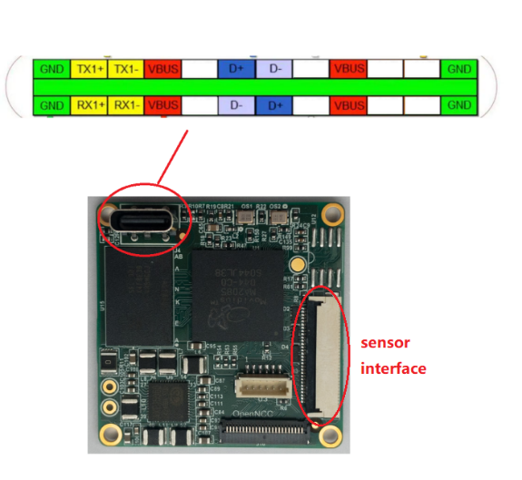
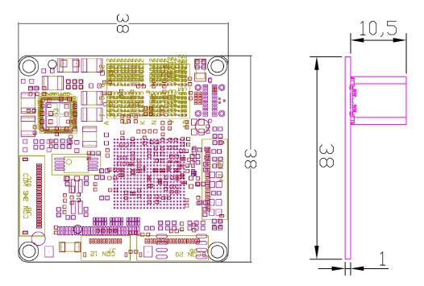

# VCAM Platform

## Hardware specifications

Interface Definition USB interface: TYPE C (the direction of the picture supports USB3.0, when the reverse is inserted to identify as USB2.0)

Structure size：38mm*38mm（Standard 38 board, space spacing 34mm）

FPC J3 Interface definition :

| ID   | PIN           | describe         | Electrical characteristics |
| ---- | ------------- | ---------------- | -------------------------- |
| 1    | VDD_5V        | 5V Power output  | Output current≤1A          |
| 2    | VDD_5V        | 5V Power output  | 2                          |
| 3    | VDD_5V        | 5V Power output  | 3                          |
| 4    | GND           | Reference ground | /                          |
| 5    | GND           | Reference ground | /                          |
| 6    | GND           | Reference ground | /                          |
| 7    | CAM_A_AUX     | GPIO             | 1.8V                       |
| 8    | CAM_A_RST     | GPIO/Reset       | 1.8V                       |
| 9    | I2C1_SCL      | I2C CLK          | 1.8V                       |
| 10   | COM_IO1       | GPIO             | 1.8V                       |
| 11   | CAM_A_CLK     | GPIO/CLK         | 1.8V                       |
| 12   | CAM_B_AUX     | GPIO/Power down  | 1.8V                       |
| 13   | COM_IO2       | GPIO             | 1.8V                       |
| 14   | CAM_A_PWM/RST | GPIO             | 1.8V                       |
| 15   | I2C1_SDA      | I2C Data         | 1.8V                       |
| 16   | GND           | Reference ground | /                          |
| 17   | CAM_A_D1_P    | MIPI Data-1 P    | /                          |
| 18   | CAM_A_D1_N    | MIPI Data-1 N    | /                          |
| 19   | GND           | Reference ground | /                          |
| 20   | CAM_A_D0_P    | MIPI Data-0 P    | /                          |
| 21   | CAM_A_D0_N    | MIPI Data-0 N    | /                          |
| 22   | GND           | Reference ground | /                          |
| 23   | CAM_A_L_C_P   | MIPI CLK P       | /                          |
| 24   | CAM_A_L_C_N   | MIPI CLK N       | /                          |
| 25   | GND           | Reference ground | /                          |
| 26   | CAM_A_D2_P    | MIPI Data-2 P    | /                          |
| 27   | CAM_A_D2_N    | MIPI Data-2 N    | /                          |
| 28   | GND           | Reference ground | /                          |
| 29   | CAM_A_D3_P    | MIPI Data-3 P    | /                          |
| 30   | CAM_A_D3_N    | MIPI Data-3 N    | /                          |

## Contact
- Please contact hydra@baidu.com for technical discussion with Baidu Research Institute
- More OEM/ODM hardware information at www.openncc.com and service@eyecloud.tech for contact
